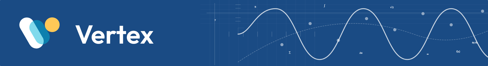

# Vertex

<p>
    
</p>

<p align="center">
    
    
    
    
</p>

**Vertex** is a modular collection of **interactive components** designed to be embedded within a host platform.

Together, this empowers educators to manage course structure static content visually. At the same time developers maintain interactive lessons, quizzes, and progress tracking independently via GitHub Pages and Firebase.

## How it works

1. The host page embeds Vertex modules via `<iframe>`.
2. All modules and the Dashboard share the same origin, which enables automatic Firebase session sharing via IndexedDB.
3. Navigation uses `window.top.location.href` to move users between host pages.
4. Progress is centralized: one Firestore document per `(user, lesson)` tracks `viewed` and `completed` states, regardless of how many iframes a lesson page contains.

## Getting started

### Prerequisites

- Firebase project with Authentication and Firestore
- `node` version 18 or higher
- `pnpm` version 8 or higher

### Environment variables

Create `.env.local` in the **root** of the monorepo:

```env
VITE_FIREBASE_API_KEY=your_api_key
VITE_FIREBASE_AUTH_DOMAIN=your_project.firebaseapp.com
VITE_FIREBASE_PROJECT_ID=your_project_id
VITE_FIREBASE_STORAGE_BUCKET=your_project.appspot.com
VITE_FIREBASE_MESSAGING_SENDER_ID=your_sender_id
VITE_FIREBASE_APP_ID=your_app_id
```

## Usage and license

This project is **dual-licensed** to separate the underlying software from the educational materials:

The software and its source code is licensed under the **MIT License**. You are free to use, modify, and distribute the code for any purpose, including commercial use, with no warranty.

All lesson text, diagrams, quizzes, curriculum structures, and media are licensed under **Creative Commons BY-NC-SA 4.0**. You may share and adapt the content for non-commercial educational purposes, provided you give appropriate credit and distribute derivatives under the same license.